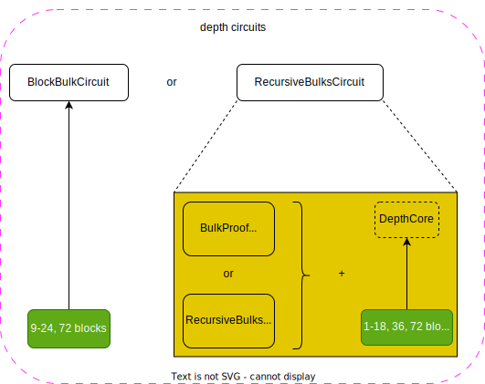
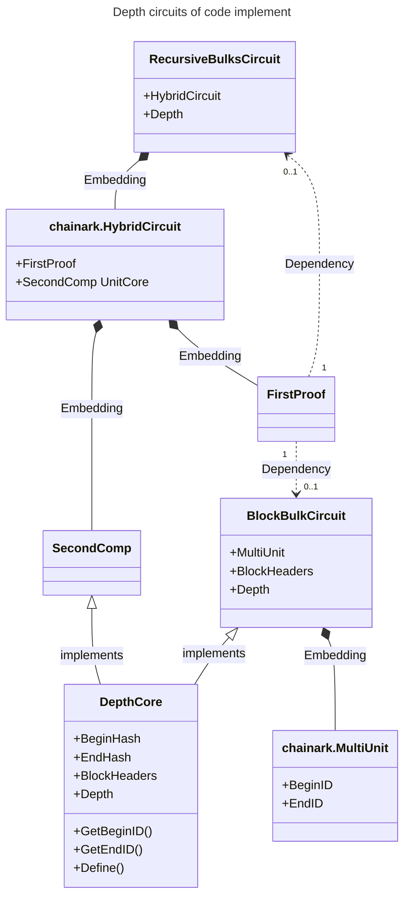
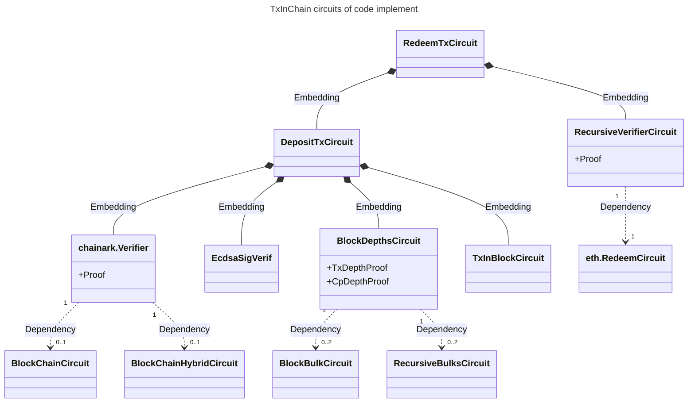

# zkBTC Security

This document is the security document for the [zkBTC decentralized bridge](https://zkbtc.money), developed by [Lightec Labs](https://lightec.xyz). Follow us on [X](https://x.com/LightecXYZ).

## Product Summary

zkBTC is a ZKP-based bridge that securely bridges Bitcoin to Ethereum and all other major L1s and L2s. The basic workflow are:

* Deposit—The user sends $BTC to a designated operator address. Such a transaction is proved, and the proof is verified in an Ethereum smart contract. After successful verification, the smart contract mints $zkBTC tokens and transfers these tokens to the address supplied along with the deposit (in an `OP_RETURN` output). The smart contract will manage the newly created UTXOs from this deposit. The miner who computes the proof and submits it on the user's behalf will receive rewards.
* Use—Users can use $zkBTC tokens in any way they wish; they are equivalent to $BTC in the Ethereum ecosystem.
* Redemption—The user calls an Ethereum smart contract function to burn some $zkBTC tokens. The function will also leave some transaction logs specifying which available UTXOs will be spent. Specifically, the smart contract will choose which UTXOs to spend this time and record related information in the logs. The miner reward is delayed.
* Change and miner reward. To bring back the change UTXO and reward the miner that computes proof for redemption, another proof about the redemption transaction in Bitcoin could be provided to the smart contract.

For more information and general use, please check out our [Gitbook](https://lightec.gitbook.io/lightecxyz).

We designed zkBTC to be fully decentralized, without any central role in operating on the users' assets. To achieve such an ambitious goal, we proposed to add an `OP_ZKP` opcode to Bitcoin so that Bitcoin can verify zero-knowledge proof as spending conditions of UTXOs. This way, there are no private keys to be managed at all for the `Redemption.` To redeem back to Bitcoin, one must submit proof meeting specific criteria. Finding a ZKP scheme for `OP_ZKP` has proven difficult, yet we have a draft [here](https://github.com/opzkp/tea-horse).

Before `OP_ZKP` could be realized, we also have an alternative solution, which is to have multiple safe platforms to manage private keys such that:

* Each platform is designed to safe-keep the private key in a way that it is nearly impossible to learn the content of the private key;
* each platform only signs the redemption transaction after a successful ZKP verification;
* We can tolerate one of the platforms being cracked or failing without losing security or assets.

Please turn to later sections for more details.

## Security Architecture


### Fully On-Chain

Recent security incidents reminded us to keep the front end safe, so we are also going to deploy it on-chain.

### Circuit Cascading

In both directions, many circuits are working together. Different circuits are combined together via verification key fingerprint binding. The basic idea is to compute a `FingerPrint` to verify the key of a circuit as the identifying value. The `FingerPrint` is computed as the `MiMc` hash of the key components of the in-circuit verifying key. The [codes](https://github.com/lightec-xyz/common/blob/master/utils/fingerprint.go) could be found in the [common component](https://github.com/lightec-xyz/common/tree/master), and is excerpted below:

```golang
// FingerPrint() returns the MiMc hash of the VerifyingKey. It could be used to identify a VerifyingKey
// during recursive verification.
func InCircuitFingerPrint[FR emulated.FieldParams, G1El algebra.G1ElementT, G2El algebra.G2ElementT](
	api frontend.API, vk *plonk.VerifyingKey[FR, G1El, G2El]) (frontend.Variable, error) {
	var ret frontend.Variable
	mimc, err := mimc.NewMiMC(api)
	if err != nil {
		return ret, err
	}

	mimc.Write(vk.BaseVerifyingKey.NbPublicVariables)
	mimc.Write(vk.CircuitVerifyingKey.Size)
	mimc.Write(vk.CircuitVerifyingKey.Generator.Limbs[:]...)

	comms := make([]kzg.Commitment[G1El], 0)
	comms = append(comms, vk.CircuitVerifyingKey.S[:]...)
	comms = append(comms, vk.CircuitVerifyingKey.Ql)
	comms = append(comms, vk.CircuitVerifyingKey.Qr)
	comms = append(comms, vk.CircuitVerifyingKey.Qm)
	comms = append(comms, vk.CircuitVerifyingKey.Qo)
	comms = append(comms, vk.CircuitVerifyingKey.Qk)
	comms = append(comms, vk.CircuitVerifyingKey.Qcp[:]...)

	for _, comm := range comms {
		el := comm.G1El
		switch r := any(&el).(type) {
		case *sw_bls12377.G1Affine:
			mimc.Write(r.X)
			mimc.Write(r.Y)
		case *sw_bls12381.G1Affine:
			mimc.Write(r.X.Limbs[:]...)
			mimc.Write(r.Y.Limbs[:]...)
		case *sw_bls24315.G1Affine:
			mimc.Write(r.X)
			mimc.Write(r.Y)
		case *sw_bw6761.G1Affine:
			mimc.Write(r.X.Limbs[:]...)
			mimc.Write(r.Y.Limbs[:]...)
		case *sw_bn254.G1Affine:
			mimc.Write(r.X.Limbs[:]...)
			mimc.Write(r.Y.Limbs[:]...)
		default:
			return ret, fmt.Errorf("unknown parametric type")
		}
	}

	mimc.Write(vk.CircuitVerifyingKey.CommitmentConstraintIndexes[:]...)

	result := mimc.Sum()

	return result, nil
}
```

### Defense in Depth

A single-factor defense might attract potential adversaries. Therefore, we designed the system with defense in depth in mind. For deposit, we rely on the ICP's Bitcoin integration to sign off on the `chain tip` and the `CheckPoint` mechanism. For redemption, two of three multi-sig also provide fault tolerance. See related sections for more details.

### Security over UX

zkBTC is designed to be fully decentralized, so there is no central role in operating the risk parameters. We have to assume the worst case and defend zkBTC against it. Therefore, the UX has to yield in case there is a conflict. For example, we require each Bitcoin deposit transaction to have a confirmation depth of at least nine instead of six. There are many more such examples throughout this document.

Third-party services could enhance UX since zkBTC is designed to be fully decentralized. The basic idea is for the third-party service to deposit to the zkBTC system, obtain some zkBTC tokens, and later provide those tokens to users with better UX. Of course, third parties are free to define their business models. 

## Audit Reports


## Securing Deposits

### Defense in Depth - Overall Design

We have designed three defenses against potential attacks, layered in depth:

* `DepositTxCircuit.SigVerif` checks if the `chain tip` (the latest block hash) is signed by a `DFinity` canister. This is the initial implementation of our long-term security design of decentralized roles signing off the `chain tip`.
* The `Transaction Depth` check demands that each deposit transaction have a certain confirmation depth. Note that the commonly recommended depth of `6` is based on on-chain verification, while in our system, it is essentially an off-chain verification. Therefore, we require at least `9` for small deposits and even deeper for large deposits.
* The `CheckPoint Depth` check demands that the enclosing block for each transaction is one of the descendants of a certain recognized `CheckPoint` (also a Bitcoin block hash).

Now, assuming some potent attacker commanding lots of hashing power has already cracked the first defense, the decentralized roles to sign off the chain tip. It still has to manage enough checkpoint depth. The attacker won't be able to meet both the `Transaction Depth` requirement and the `CheckPoint Depth` requirement if we set proper checking rules in the smart contract. Before discussing any specific rules, we must point out the obvious: it is impossible to pass all legit blocks without passing some offending blocks if the adversary indeed masters too much hashing power. Our aim here is not to reject all offending blocks but to make it as computation-intensive as possible for adversaries, such that attacking us is not economically desirable.

### Circuits Diagrms

#### depth circuits

depth circuits proves that BlockM is ancestor of BlockN, and prove that the depth from BlockM to BlockN is n-m.

**note:** The minimum depth of tx is 9, and the minimum depth of cp is 72

These circuits includes 2 groups external circuits:

* `BlockBulkCircuit`, prove hat when the depth is 9-24 or 72.
* `RecursiveBulksCircuit`,  prove that when the depth is > 24. RecursiveBulksCircuit is based on the BlockBulkCircuit proof with a depth of 24 or 72, and then absorbs a depth of 1-9, 18, 36, or 72, repeatedly recursing on itself.





#### BlockChain circuit

BlockChain circuits prove that a chain is formed from genesis block to blockN, and prove that the difficulty adjustment every 2016 blocks meets the rules.

BlockChain circuits are based on chainark. There are 3 auxiliary circuits:

* `BaseLevelCircuit` proves that 112 blocks form a chain, called a batch.
* `MidLevelCircuit` proves that 6 batches form a chain, each with 112 blocks. Total is 672 blocks, called a super batch.
* `UpperLevelCircuit` proves that 3 super batches form a chain. Total is 2016 blocks.

Then there are one `BlockChainCircuit` and multiple `BlockChainHybridCircuit`:

* `BlockChainCircuit` combines two existing proofs into one, extending the chain.
* `BlockChainHybridCircuit(n)` recursively verifies one existing proof (of `BlockChainCircuit` or `BlockChainHybridCircuit`), plus some more blocks to form a chain, effectively extending the chain proven by the existing proof. There are multiple instances: `n := {1, 2, ..., MiniLevel, MiniLevel*2+1, MiniLevel*3+2, MiniLevel*4+3}`. Numbers are chosen to minimize recursive verifications.

Detailed design 

#### tx circuits

tx circuits proves that `deposit` or `redeem` transaction is on-chain and the depth of the tx meets `the minimum tx depth`. The chain is formed from `the genesis block` to `the latest block`, meets the difficulty adjustment rules, and passes through a well-known `checkpoint block`. The genesis block is well known, and the latest block is accepted and signed by a designated `DFinity` canister.

The tx circuits contain other circuit proofs and circuit components:

* `BlockChainProof`, proves that a consensus chain is formed from the genesis block to the latest block.
* `CpDepthPoof`, proves that the chain passes through the well-known checkpoint block and its depth meets the minimum cp depth.
* `TxInBlockCircuit` and `TxDepthPoof`, prove that tx is in a block and the depth of the block on the chain meets the minimum tx depth.
* `EcdsaSigVerif`, proves that the latest block of this chain was accepted and signed by Dfinity.
* `RedeemInEthProof`, proves that the redeem tx in ETH has been finalized on the ETH chain.

The tx circuits 2 external circuits:

* `DepositTxCircuit`, proves that the deposit tx in BTC has been confirmed by the specified minimum depth on the BTC chain.
* `RedeemTxCircuit`, proves that the redeem tx in BTC has been confirmed by the specified minimum depth on the BTC chain, and prove that its previous ETH redeem tx is also finalized on the ETH chain.





### Circuit Cascading

So the circuits are organized as below (`FP(Circuit)` is short for `FingerPrint(Circuit.Vkey)`):

```
# for BlockChain circuits

MidLevel.UnitFp   = FP(BaseLevel)
UpperLevel.UnitFp = FP(MidLevel)

BlockChainHybridCircuit(n) : {1, ..., 18, 37, 56, 75}

BlockChainFpSet :=  {    
                        FP(BlockChainCircuit), 
                        FP(BlockChainHybridCircuit(1)), ..., FP(BlockChainHybridCircuit(18)), 
                        FP(BlockChainHybridCircuit(37)), FP(BlockChainHybridCircuit(56)), FP(BlockChainHybridCircuit(75))
                    }

BlockChainCircuit.UnitFps          = {FP(BaseLevel), FP(UpperLevel)}
BlockChainCircuit.SelfFps          = BlockChainFpSet

BlockChainHybridCircuit(n).UnitFps = {FP(UpperLevel)}
BlockChainHybridCircuit(n).SelfFps = BlockChainFpSet

# for BlockDepth circuits

BlockBulkCircuit(n)      : {9, ..., 24, 72}
RecursiveBulksCircuit(n) : {1, ..., 18, 36, 72}

BlockBulkFpSet :=       {
                            FP(BlockBulkCircuit(9)), ..., FP(BlockBulkCircuit(24)),
                            FP(BlockBulkCircuit(72))
                        }

RecursiveBulksFpSet :=  {
                            FP(RecursiveBulksCircuit(1)), ..., FP(RecursiveBulksCircuit(18)),
                            FP(RecursiveBulksCircuit(36)), FP(RecursiveBulksCircuit(72)),
                        }

DepthFpSet := BlockBulkFpSet UNION RecursiveBulksFpSet

RecursiveBulksCircuit(n).UnitFps = {FP(BlockBulkCircuit(24)), FP(BlockBulkCircuit(72))} 
RecursiveBulksCircuit(n).SelfFps = RecursiveBulksFpSet
```

`UnitFp(s)` and `SelfFps` are concepts from [chainark](https://github.com/lightec-xyz/chainark):

* `UnitFp` or `UnitFps` (an array) is used to restrict which inner circuit is acceptable. It is created as circuit constant to its enclosing circuit, such that the value changes shall result in a different circuit.
* `SelfFps` is used to specify a set of circuits including the `self` circuit, so that each circuit in the set could verify proofs from other circuits from the same set. That means each circuit in the set should be able to verify a proof generated by itself (in an earlier invocation). This is how we achieve recursive verification for the entire Bitcoin chain. `SelfFps` is public witness to its enclosing circuit. 

Finally, `DepositTxCircuit` is in charge of generating proofs to be submitted to Ethereum for the purpose of minting `zkBTC` tokens. Among other verifications, it recursively verifies:

* one `BlockChainCircuit` or `BlockChainHybridCircuit(n)` proof
```
DepositTxCircuit.BlockChain.UnitFps = BlockChainFpSet
```
* two proofs from `BlockBulkCircuit(n)` or `RecursiveBulksCircuit(n)`, one for `Transaction Depth` verification, another for `CheckPoint Depth` verification
```
DepositTxCircuit.BlockDepths.UnitFps = DepthFpSet
```

### CheckPoint

#### Estimating CheckPoint Depth

The smart contract must estimate the checkpoint depth on its own to determine whether the value presented in the proof is acceptable. 

In case the transaction is even deeper than the checkpoint or just rests in the checkpoint block, we simply return true for checkpoint depth checking, as the checkpoint is trusted by the smart contract. Otherwise, our first attempt is: 
```Solidity
    estimated_depth = (eth_block.timestamp - tx_block.timestamp) / 600 + (cp_depth - tx_depth);
```

We assume the Ethereum timestamp as obtained by `block.timestamp` is very close to real-time as of the contract execution ([ref](https://ethereum.stackexchange.com/questions/5927/how-would-a-miner-cope-with-a-huge-block-time)). However, since the Bitcoin transaction and its enclosing block could be generated by the adversary, its timestamp could not be trusted. As `cp_depth` could also be derived from the adversary's fork chain, it is also not reliable. 

Alternatively, we could compute the average interval between checkpoint and 'now' and then estimate the depth. However, this computation requires unreliable `cp_depth`.

We assume a 10-minute average block interval here. This interval is often *not* the actual case. A variation of 10% is relatively common and is handled with allowance. See the following sections.
```Solidity
    estimated_depth = (eth_block.timestamp - cp_block.timestamp) / 600;
```

What if the proof submission is purposefully delayed such that `eth_block.timestamp` is much later than it should have been? In that case, the `estimated_depth` would be larger than the actual value. This does the adversary no good. For the same reason, a valid deposit might be declined if the submission is delayed for too long. Fortunately, this will not happen a lot in our proving-as-mining incentive setting. Every miner will do their best to submit proof as soon as possible to earn proving rewards.

#### Checking CheckPoint Depth

Suppose the attacker has 10% of all honest hashing power combined; on average, it has to spend at least 900 minutes (15 hours) to meet the transaction depth requirement for a small amount deposit, which requires `tx_depth` to be at least 9. Meanwhile, around 90 new blocks have been mined in the Bitcoin mainnet. The attacker would find out the checkpoint depth deficit to be 81. If the attacker has 30% of all hashing power, numbers become 300 minutes, 30 new blocks, and 21 blocks of checkpoint depth deficit. 

The smart contract, however, needs to take care of block timestamp drift, proof generation time, block interval variance, time to broadcast the smart contract invocation transaction and include it in a block, etc. For example, the timestamp of any Bitcoin block might be as early as just a bit later than the median value of its past 11 blocks. That will generate 1 hour or about six blocks more than the actual depth since we use `eth_block.timestamp` to estimate the checkpoint depth. The smart contract will have to subtract 6 or more from its estimated depth so that a *legit* deposit won't be declined. We could leave some more time for various other factors, ranging from half to one hour. Thus:
```
    required_minimal_depth = estimated_depth - allowance
```

#### Setting a Proper Allowance

Specifically, we'd like to reserve 6 for the potential checkpoint timestamp error, 2 for waiting for the chain tip to be available and proof to be generated, and then 1 for every additional 4 confirmation depth requirements covering the variation of hashing power and block time.
```
    allowance = 6 + 2 + (depth - 6)/6 = 7 + depth/4
```

Therefore, for transaction confirmation depth requirements of 9, 12, 18, and 24 and the checkpoint candidate depth requirement of 36, the corresponding allowance is 10, 10, 12, 13, and 16.

#### Becoming a CheckPoint Candidate

`CheckPoint` is maintained by the Ethereum smart contract without human intervention. The hash of the enclosing block for a **deep** enough transaction could be a candidate for a new `CheckPoint`. When it is time to rotate checkpoints, the smart contract selects a random candidate. Our security does *not* depend on how random the selection process is. Instead, we impose a depth requirement for each of the candidate such that the adversary won't be able to reach without failing the checkpoint depth test. Our security architecture weighs checkpoint safety more than individual blocks or transactions. Note that the formula of `estimated_depth` already assumes that the adversary starts to mine its own blocks based on a would-be checkpoint block when it is freshly mined. Successful guessing of the next checkpoint grants no additional advantages to adversaries.

Besides the depth requirement for checkpoint candidate, we also check if the timestamp of the checkpoint block is not too far in its past or future. According to the Bitcoin consensus rules, the timestamp of the checkpoint block could be at most 2 hours in its future, resulting in some *free* depth to adversaries. We ran some checks in the circuit to prevent this free depth from becoming too many and proved a flag, which the smart contract could check. On the other hand, if the checkpoint timestamp is in its past, legit deposit might be declined. So, the circuit also checks this case and sets a flag accordingly.

What if the in-circuit check is unreliable enough (for example, the blocks we use to check the timestamp are ALL in their future), and the checkpoint candidate still carries a timestamp in its past or future that is too far away? 

Although the in-circuit check is a strong defense, we could still discuss this hypothetical case under the *Defense in Depth* principle:
```Solidity
    estimated_depth = (eth_block.timestamp - (cp_block.true_timestamp + 7200)) / 600
                    = better_estimation - free_depth;
    free_depth      = 12;
```

Note that `better_estimation` is unknown to the smart contract and is used here simply to clarify this text.

#### Free Depth from Consensus

There is another source of *free* depth besides what we have discussed so far. If there are lots of new mining power joining the game, the average block interval could be greatly shrunk.

Let's discuss a concrete yet hypothetical case, that after a checkpoint is selected only a few blocks after a new mining difficulty had been settled. Immediately after the checkpoint selectioin, some mining power joins the game just to drive the average block time to below 8 minutes instead of 10. 20 hours later, the main-net generates 150 new blocks intead of 120. The excessive 30 new blocks give the adversary a huge boost. The adversary could take quite some time to mine some new blocks and still meet the checkpoint depth requirement.

Our solution is to derive the actual average block interval from the block data, and prove it with the zkp circuit. Then the smart contract may check the proven block interval carefully and decide that:

* if the proven interval is shorter than 10 minutes, use it to estimate the checkpoint depth;
* otherwise, keep using the 10-minutes interval.

Remember we mentioned earlier that the proof could be generated by the adversary, and the timestamp could be manipulated especially for the block enclosing the transaction or the chain tip (we are talking about defense in depth here so we do not count in the signature to the chain tip). Under this situation, the proven interval could be made very close to 10 minutes. Then the smart contract uses the 10-minute interval to estimate the checkpoint depth, and free depth is awarded to adversary. We must use the timestamp less likely to be manipulated. 

And we do have options. The smart contract imposes a minimal depth requirement for the checkpoint, which is set to 72 as of the time of this writing. So we could trace back 24 blocks from the chain tip, and calculate the average interval between this point and the checkpoint. We have at least 48 blocks counted in. This provides good enough estimation except in the case when the mining difficulty adjustment is not included. The adversary could attempt to mine at least 25 blocks, however, this is very computation intensive. We will get back to this issue at the end of this Checkpoint subsection.

On the other hand and in the worst case, if the mining difficulty adjustment happens right at the beginning of the 24 excluded-from-average blocks, and assuming to the extent that the main-net starts to generate new blocks every 8 minutes, the adversary could obtain at most `24 - (24 * 8 / 10) = 4.8` free blocks. This is still not directly usable to the adversary, as these blocks are generated by the main-net.

#### Putting Everything Together

We need to find out the threshold of hashing power that an adversary must command in order to defeat our checkpoint system. Given:
```Solidity
    estimated_depth = (eth_block.timestamp - (cp_block.true_timestamp + 7200)) / 600
                    = better_estimation - free_depth;
    free_depth      = 12 + 4.8 ~= 17;
    required_minimal_depth = estimated_depth - allowance;
    allowance = 7 + depth/4
```

Suppose the transaction depth requirement is D (D = 9 for small deposits, 12 for medium amounts, and 18 and 24 for even larger amounts), and the attacker commands x% hashing power compared to all honest miners combined. At some point on or after the checkpoint block, the attacker must begin to mine its own blocks. To meet the transaction depth requirement, the attacker must spend `average_attacker_time_for_D_blocks` on average, assuming the average block interval to be 10 minutes:
```golang
    average_attacker_time_for_D_blocks := D * 600 / (x/100) = D * 60000/x
```

Meanwhile, the mainnet keeps producing new blocks; the expected average blocks mined are:
```golang
    expected_average_blocks_mainnet := average_attacker_time_for_D_blocks / 600 = D * 100/x
```

During this period, the checkpoint depth that the attacker would obtain will lag behind that of the mainnet by `cp_depth_diff`:
```golang
    cp_depth_diff := expected_average_blocks_mainnet - D = D * (100/x - 1)
```

The attacker needs `cp_depth_diff <= allowance`. But since there could be free depth, he needs only `cp_depth_diff <= allowance + free_depth` or:
```golang
    // D * (100/x - 1) <= allowance + free_depth <--> x >= 100*D/(allowance + D + 17)
    // (allowance + D + 17) must be positive
```

Solving the above inequalities for `(D, allowance) = (9, 10)`:
```golang
    // x >= 900/(9 + 10 + 17) = 25.0
```
And for `(D, allowance) = (12, 10), (18, 12), (24, 13)`
```golang
    // x >= 1200/(12 + 10 + 17) = 30.8
    // x >= 1800/(18 + 12 + 17) = 38.3
    // x >= 2400/(24 + 13 + 17) = 44.4
```

Note that we were talking about average cases. There are small chances that the attacker mines more blocks sooner than average. However, the block time variation has been handled with the allowance value (see earlier sections).

The `tx_depth` requirement for a checkpoint candidate is set to 36 (with `allowance` set to 16):
```golang
    // x >= 3600/(36 + 16 + 17) = 52.2
```

Note that we include the 4.8 free depth from the rare situation, and the 12 free depth is also not easy to obtain for the adversary. So the above numbers are for the worse case. The actual safety margin is better. For example, we might consider when the free depth is at most 6 instead of 17 for `(D, allowance) = (9, 10), (36, 16)`:
```golang
    // x >= 900 /( 9 + 10 + 6) = 36.0 (compared to 25.0)
    // x >= 3600/(36 + 16 + 6) = 62.1 (compared to 52.2)
```

#### Escalating the Depth Requirement

It seems not profitable to spend at least 30% of all total-net hashing power just to make a fake deposit of a small amount. The attacker, however, no double will try to stuff as many transactions as possible into one block and hope to deposit all of them successfully.

To counter this measure, we keep the count of deposit transactions per block and escalate the depth requirement once a certain limit is reached.

#### An Even More Aggressive Attacker

In the above discussion, we assume the attacker uses *new* hashing power instead of drawing the *existing* mining power to compute the attack. This way, the mainnet is generating new blocks at a relatively steady rate. However, if a very powerful attacker can turn some existing hashing power to attack zkBTC, then the rate at which the mainnet produces new blocks will be slowed down. And our analysis is impacted. This is the typical `p vs q` situation in the original [Bitcoin Whitepaper](https://bitcoin.org/bitcoin.pdf).

Nonetheless, our security architecture does not rely on the actual block interval. We use the expected 10 minutes and then `allowance` to handle any variation. So if the supposed situation does happen, then instead of invalid deposits being accepted, valid deposits might get declined as the checkpoint depth requirement cannot be met, but only temporarily.

To recover from this situation, the mainnet must have mined blocks faster than the 10-minute expectation to compensate for the 'lost depth'. This could happen a while after the attacker has stopped without gains, or more honest hashing power joins the mining as their owners see the opportunity or the difficulty adjustment results in a lower difficulty due to a prolonged average block interval and hence faster block mining.

#### Revisiting the Free Depth from Consensus

To be specific, let's assume the checkpoint is very deep already and there are lots of free depth. The adversary manages to mine 25 blocks in the fork chain, with the timestamp manipulated so that the computed interval `interval = (section_end_timestamp - checkpoint_timestamp) / nb_blocks` is close to 10 minutes. Then the adversary could have all those free depth to meet the checkpoint depth requirements. Of course since 25 blocks have been in the fork chain, the transaction depth requirement is also meet for transactions not too large. Can he get away? Not if we simply apply the consensus rule that any block's timestamp cannot be more than 2 hours in the future of the network adjusted time. Since there is *no* network adjusted time in the context of ZKP, we consider using the median timestamp of the past 11 blocks plus their average interval multiplied by 6. (see [issue #4](https://github.com/lightec-xyz/zkBTC-Security/issues/4)). Specifically, we cap the timestamp of the last block used to compute the average interval, to the value calculated as `median(timestamp of the past 11 blocks) + average block interval(the past 11 blocks) + 2 hours`.

Now assuming the fast block generation (one block per `r` minutes, `r < 10`) has been lasting for `h` hours (`60h` minutes) since the checkpoint, and the adversary has `x%` of hashing power of all honest miners combined. The adversary will have to spend `max(D, 25) * r / (x/100) = 100mr/x` minutes to mine at least 25 blocks, where `m` denotes `max(D,25)`. The estimated checkpoint depth, assuming he is able to instantly compute the proof, would be `(100mr/x + 60h) / maniputed_interval`. Since the adversary manipulated the timestamp to get additional 2 hours, we have `maniputed_interval = (2 + h)*60/(60h/r) = r(2+h)/h`. Finally, the estimated checkpoint depth is `(100mr/x + 60h) / (r(2+h)/h) = (100mr/x + 60h)h/(r(2+h))`.

Yet the adversary could only prove `60h/r + 25` blocks.  

Solve `60h/r + 25 >= (100mr/x + 60h)h/(r(2+h)) - allowance` for various `r`, `h` values and `(D, allowance)` combinations:

$$60h/r + 25 \ge (100mr/x + 60h)h/(r(2+h)) - allowance$$

$$ \iff (60h/r + 25 + allowance) * r * (2+h) \ge (100mr/x + 60h)h $$

$$ \iff (60h + 25r + allowance * r) * (2+h)/h \ge (100mr/x + 60h)$$

$$ \iff (60h + 25r + allowance * r) * 2/h + 25r + allowance*r \ge 100mr/x$$

$$ \iff 120 + 50r/h + allowance * r * 2/h + 25r + allowance*r \ge 100mr/x$$

$$ \iff x \ge 100mr/(120 + 50r/h + allowance * r * 2/h + 25r + allowance*r) $$

| r    |    h   |    D    |   allowance  |    x    |
| :-------- | ------- | ------- | ------- | ------- |
| 8 | 6 | 9 | 10 | 40 |
| 8 | 6 | 12 | 10 | 40 |
| 8 | 6 | 18 | 11 | 39 |
| 8 | 6 | 24 | 13 | 38 |
| 8 | 6 | 36 | 16 | 51 |
| 8 | 6 | 48 | 19 | 65 |
| 8 | 6 | 72 | 25 | 88 |
| 8 | 12 | 9 | 10 | 44 |
| 8 | 12 | 12 | 10 | 44 |
| 8 | 12 | 18 | 11 | 43 |
| 8 | 12 | 24 | 13 | 42 |
| 8 | 12 | 36 | 16 | 57 |
| 8 | 12 | 48 | 19 | 72 |
| 8 | 12 | 72 | 25 | 98 |
| 8 | 18 | 9 | 10 | 46 |
| 8 | 18 | 12 | 10 | 46 |
| 8 | 18 | 18 | 11 | 45 |
| 8 | 18 | 24 | 13 | 43 |
| 8 | 18 | 36 | 16 | 59 |
| 8 | 18 | 48 | 19 | 75 |
| 8 | 18 | 72 | 25 | 102 |
| 8 | 24 | 9 | 10 | 47 |
| 8 | 24 | 12 | 10 | 47 |
| 8 | 24 | 18 | 11 | 46 |
| 8 | 24 | 24 | 13 | 44 |
| 8 | 24 | 36 | 16 | 60 |
| 8 | 24 | 48 | 19 | 76 |
| 8 | 24 | 72 | 25 | 104 |
| 8 | 30 | 9 | 10 | 47 |
| 8 | 30 | 12 | 10 | 47 |
| 8 | 30 | 18 | 11 | 46 |
| 8 | 30 | 24 | 13 | 45 |
| 8 | 30 | 36 | 16 | 61 |
| 8 | 30 | 48 | 19 | 77 |
| 8 | 30 | 72 | 25 | 105 |
| 8 | 36 | 9 | 10 | 48 |
| 8 | 36 | 12 | 10 | 48 |
| 8 | 36 | 18 | 11 | 47 |
| 8 | 36 | 24 | 13 | 45 |
| 8 | 36 | 36 | 16 | 61 |
| 8 | 36 | 48 | 19 | 78 |
| 8 | 36 | 72 | 25 | 106 |
| 8 | 48 | 9 | 10 | 48 |
| 8 | 48 | 12 | 10 | 48 |
| 8 | 48 | 18 | 11 | 47 |
| 8 | 48 | 24 | 13 | 45 |
| 8 | 48 | 36 | 16 | 62 |
| 8 | 48 | 48 | 19 | 79 |
| 8 | 48 | 72 | 25 | 107 |
| 8 | 60 | 9 | 10 | 48 |
| 8 | 60 | 12 | 10 | 48 |
| 8 | 60 | 18 | 11 | 47 |
| 8 | 60 | 24 | 13 | 46 |
| 8 | 60 | 36 | 16 | 62 |
| 8 | 60 | 48 | 19 | 79 |
| 8 | 60 | 72 | 25 | 108 |
| 8 | 72 | 9 | 10 | 49 |
| 8 | 72 | 12 | 10 | 49 |
| 8 | 72 | 18 | 11 | 48 |
| 8 | 72 | 24 | 13 | 46 |
| 8 | 72 | 36 | 16 | 63 |
| 8 | 72 | 48 | 19 | 79 |
| 8 | 72 | 72 | 25 | 108 |
| 8 | 144 | 9 | 10 | 49 |
| 8 | 144 | 12 | 10 | 49 |
| 8 | 144 | 18 | 11 | 48 |
| 8 | 144 | 24 | 13 | 46 |
| 8 | 144 | 36 | 16 | 63 |
| 8 | 144 | 48 | 19 | 80 |
| 8 | 144 | 72 | 25 | 109 |
| 8 | 288 | 9 | 10 | 49 |
| 8 | 288 | 12 | 10 | 49 |
| 8 | 288 | 18 | 11 | 48 |
| 8 | 288 | 24 | 13 | 46 |
| 8 | 288 | 36 | 16 | 64 |
| 8 | 288 | 48 | 19 | 81 |
| 8 | 288 | 72 | 25 | 110 |
| 8 | 576 | 9 | 10 | 50 |
| 8 | 576 | 12 | 10 | 50 |
| 8 | 576 | 18 | 11 | 48 |
| 8 | 576 | 24 | 13 | 47 |
| 8 | 576 | 36 | 16 | 64 |
| 8 | 576 | 48 | 19 | 81 |
| 8 | 576 | 72 | 25 | 110 |
| 9 | 6 | 9 | 10 | 41 |
| 9 | 6 | 12 | 10 | 41 |
| 9 | 6 | 18 | 11 | 40 |
| 9 | 6 | 24 | 13 | 39 |
| 9 | 6 | 36 | 16 | 52 |
| 9 | 6 | 48 | 19 | 66 |
| 9 | 6 | 72 | 25 | 90 |
| 9 | 12 | 9 | 10 | 46 |
| 9 | 12 | 12 | 10 | 46 |
| 9 | 12 | 18 | 11 | 45 |
| 9 | 12 | 24 | 13 | 43 |
| 9 | 12 | 36 | 16 | 58 |
| 9 | 12 | 48 | 19 | 74 |
| 9 | 12 | 72 | 25 | 100 |
| 9 | 18 | 9 | 10 | 47 |
| 9 | 18 | 12 | 10 | 47 |
| 9 | 18 | 18 | 11 | 46 |
| 9 | 18 | 24 | 13 | 45 |
| 9 | 18 | 36 | 16 | 61 |
| 9 | 18 | 48 | 19 | 77 |
| 9 | 18 | 72 | 25 | 104 |
| 9 | 24 | 9 | 10 | 48 |
| 9 | 24 | 12 | 10 | 48 |
| 9 | 24 | 18 | 11 | 47 |
| 9 | 24 | 24 | 13 | 45 |
| 9 | 24 | 36 | 16 | 62 |
| 9 | 24 | 48 | 19 | 78 |
| 9 | 24 | 72 | 25 | 106 |
| 9 | 30 | 9 | 10 | 49 |
| 9 | 30 | 12 | 10 | 49 |
| 9 | 30 | 18 | 11 | 48 |
| 9 | 30 | 24 | 13 | 46 |
| 9 | 30 | 36 | 16 | 63 |
| 9 | 30 | 48 | 19 | 79 |
| 9 | 30 | 72 | 25 | 108 |
| 9 | 36 | 9 | 10 | 49 |
| 9 | 36 | 12 | 10 | 49 |
| 9 | 36 | 18 | 11 | 48 |
| 9 | 36 | 24 | 13 | 46 |
| 9 | 36 | 36 | 16 | 63 |
| 9 | 36 | 48 | 19 | 80 |
| 9 | 36 | 72 | 25 | 108 |
| 9 | 48 | 9 | 10 | 50 |
| 9 | 48 | 12 | 10 | 50 |
| 9 | 48 | 18 | 11 | 49 |
| 9 | 48 | 24 | 13 | 47 |
| 9 | 48 | 36 | 16 | 64 |
| 9 | 48 | 48 | 19 | 81 |
| 9 | 48 | 72 | 25 | 110 |
| 9 | 60 | 9 | 10 | 50 |
| 9 | 60 | 12 | 10 | 50 |
| 9 | 60 | 18 | 11 | 49 |
| 9 | 60 | 24 | 13 | 47 |
| 9 | 60 | 36 | 16 | 64 |
| 9 | 60 | 48 | 19 | 81 |
| 9 | 60 | 72 | 25 | 110 |
| 9 | 72 | 9 | 10 | 50 |
| 9 | 72 | 12 | 10 | 50 |
| 9 | 72 | 18 | 11 | 49 |
| 9 | 72 | 24 | 13 | 47 |
| 9 | 72 | 36 | 16 | 64 |
| 9 | 72 | 48 | 19 | 81 |
| 9 | 72 | 72 | 25 | 111 |
| 9 | 144 | 9 | 10 | 51 |
| 9 | 144 | 12 | 10 | 51 |
| 9 | 144 | 18 | 11 | 50 |
| 9 | 144 | 24 | 13 | 48 |
| 9 | 144 | 36 | 16 | 65 |
| 9 | 144 | 48 | 19 | 82 |
| 9 | 144 | 72 | 25 | 112 |
| 9 | 288 | 9 | 10 | 51 |
| 9 | 288 | 12 | 10 | 51 |
| 9 | 288 | 18 | 11 | 50 |
| 9 | 288 | 24 | 13 | 48 |
| 9 | 288 | 36 | 16 | 65 |
| 9 | 288 | 48 | 19 | 83 |
| 9 | 288 | 72 | 25 | 113 |
| 9 | 576 | 9 | 10 | 51 |
| 9 | 576 | 12 | 10 | 51 |
| 9 | 576 | 18 | 11 | 50 |
| 9 | 576 | 24 | 13 | 48 |
| 9 | 576 | 36 | 16 | 66 |
| 9 | 576 | 48 | 19 | 83 |
| 9 | 576 | 72 | 25 | 113 |

`x` is at least 38. Looks fine already, and even more so considering that the fast block generation does not happen a lot.

### Defense in Depth - Replacing Chain Tip Signature with More Depth Requirements

In the discussion, the chain tip's signature has become the single point of failure (SPoF). That is, if, for some reason, the ICP canister cannot sign the Bitcoin tip block, then we cannot generate proof that it is acceptable to the deployed smart contract. To overcome this hurdle, we could replace the signature with more depth requirements.

Our current practice is to double the depth requirements, and update the allowance value accordingly. This is on top of the depth requirement escalation mentioned earlier.

With this design, we have two new depth requirements: (D, allowance) = (48, 19), (72, 25). The hashing power requirements for the attacker are:
```golang
    // x >= 4800/(48 + 19 + 17) = 57.1
    // x >= 7200/(72 + 25 + 17) = 63.2
```

## Securing Redemption

### The Ethereum Light Client Protocol

We use the Ethereum Light Client Protocol (LCP) to determine if the transaction to call the designated redeem function has been completed successfully and the enclosing block has been finalized. This includes the major parts:

* the transaction to call the designated redeem function has been completed successfully and left some logs as receipts;
* the transaction belongs to a block;
* the block is an ancestor of another block, which has been finalized as being signed off by a sync committee;
* there exists a signature chain from the genesis sync committee to the signing sync committee;

By proving the above assertions, we are sure that the redeem function has been executed as expected. Then, we can extract data from the proven logs, assemble a Bitcoin transaction, and send it along with the proof to be verified and signed/executed. Note that all the information needed to assemble the Bitcoin transaction, including all the available UTXOs, is managed with the smart contract. 

### opZKP

Our long-term plan is to upgrade Bitcoin to support [`OP_ZKP`](https://github.com/opzkp/tea-horse). Then, we can supply Bitcoin with the transaction (inputs, outputs) and its (segregated) witness (proof). The proof serves as the spending conditions of the input UTXOs, much like a signature in a regular Bitcoin transfer transaction. Once the verification is successful, the Bitcoin network can process the transaction, and the user will get the redeemed $BTC.

### MultiSig Design

The interim solution is to use a two-of-three multi-sig scheme. As mentioned at the beginning of this document, we need multiple safe platforms to manage private keys such that:

* Each platform is designed to safe-keep the private key in a way that it is nearly impossible to learn the content of the private key;
* Each platform only signs the redemption transaction after a successful ZKP verification;
* We can tolerate one of the platforms being cracked or failing without losing security or assets.

And our choices are:

* ICP [tECDSA](https://internetcomputer.org/docs/references/t-sigs-how-it-works/), available in a canister programmed to verify proof before signing the transaction. And the private key is never reconstructed during signing. 
* Oasis [Sapphire](https://oasisprotocol.org/sapphire), an EVM compatible L1 based on TEE technology. The Intel SGX technology used in Oasis Sapphire can protect both the private key and the integrity of the enclave code so that no one can bypass the proof verification placed before transaction signing.
* Intel SGX-enabled machines, similar to Oasis Sapphire, are operated by the Lightec team. SGX technology ensures that even the Lightec team cannot learn the private key content or bypass the "proof-verfication-before-signature" logic.

Interested readers may refer to ICP or Oasis documents for security-related information. We will cover how we program and operate the SGX enclave.

### Security of Applying SGX

For a general introduction to SGX, especially about how it could secure computation, we recommend the classic paper [Intel SGX Explained](https://eprint.iacr.org/2016/086.pdf) by Victor Costan and Srinivas Devadas. 

In a nutshell, an SGX enclave provides:

* encrypted memory content which could be decrypted only inside the CPU and visible to its owning enclave, preventing privileged OS processes or even hardware systems (BIOS, memory controller, etc.) from accessing the confidential data;
* program integrity such that once the program is tampered with, it is either an invalid or totally different enclave. In either case, it cannot decrypt any data encrypted by the original enclave.

We are building on top of [ego](https://github.com/edgelesssys/ego), a popular Golang library to use SGX. The enclave verifies a zero-knowledge proof of a redemption transaction before signing the Bitcoin transaction with a private key it manages. The private key is initially generated by the first instance of the enclave, then exported and encrypted so that only itself or another enclave with the exact binary code could decrypt inside the enclave. Put another way, even the Lightec team cannot read the content of the private key or bypass the zkp verification to obtain a signature.

Below picture outlines the interaction between client and server so that the client can retrieve the encrypted private key from server.


#### Client-Server TLS Authentication
Note that the TLS connectivity between Client and Server is bi-directionally authenticated, with pinned self-signed certificates.

1.	Each of the client and server generates a TLS certificate using an Ed25519 key pair derived from the hash of its SGX Unique Key, applying SHA256 twice: `privateKey := SHA256(SHA256(UniqueKey))`
2.	The generated certificates are then distributed to the client and server.
3.	Both the client and server load their peer certificate for bi-directional authentication.

#### Secure Secret Distribution

The server should create the secret only once, and [seal](https://pkg.go.dev/github.com/edgelesssys/ego@v1.7.0/ecrypto#SealWithUniqueKey) it with its SGX Unique Key so that it could [unseal](https://pkg.go.dev/github.com/edgelesssys/ego@v1.7.0/ecrypto#Unseal) it after restarting. After that and once the secret is restored in the enclave, server is ready for the client to retrieve the secret.

Once the TLS connection is established, the secret exchange process follows these steps:

A. Client Generates an SGX Remote Attestation Report
1.	The client generates a Secp256k1 key pair, again with the private key being `privateKey := SHA256(SHA256(UniqueKey))`. Note that this might fail with a negleble chance (less than $2^{-127}$), which is acceptable in our use.
2.	The public key is used as a parameter [to generate an SGX Remote Attestation Report](https://pkg.go.dev/github.com/edgelesssys/ego@v1.7.0/enclave#GetRemoteReport).
3.	The client sends the SGX report to the server.

B. Server Verifies the Client’s Report and Encrypts the Secret
1.	The server [verifies the client’s SGX Remote Attestation Report](https://pkg.go.dev/github.com/edgelesssys/ego@v1.7.0/enclave#VerifyRemoteReport), as well as if the Enclave Unique Id matches that of its own.
2.	It extracts the client-side public key from the client’s report.
3.	The server encrypts the secret according to the `ECIES` protocol, using the extracted public key and an ephemeral key pair. The underlying symmetric cipher suite is `AES128 + HMAC-SHA-256-16`.
4.	It computes the hash of the ciphertext.
5.	The computed hash is used as a parameter to generate the server’s SGX Remote Attestation Report.
6.	The server sends the SGX report along with the ciphertext to the client.

C. Client Verifies the Server’s Report and Decrypts the Secret
1.	The client verifies the server’s SGX Remote Attestation Report, as well as if the Enclave Unique Id matches that of its own.
2.	It extracts the ciphertext hash from the server’s SGX report.
3.	The client computes the hash of the received ciphertext.
4.	It compares the computed hash with the one extracted from the server’s SGX report.
5.	If the hashes match, the client decrypts the ciphertext using its private key.
6.	Finally, the client seals the secret using its SGX Unique Key.

Our SGX code will be open once we complete the audit and launch the product.

### The BLS Signature Verification for BLS12-381 G2

The Ethereum Light Client Protocol requires this. As related library is not available when we started to develop zkBTC, we developed such circuit on our own and we had submitted a [PR to gnark](https://github.com/Consensys/gnark/pull/1040), pending audit, review and merge.

## chainark

In deposit and redemption, we need to prove a chain of relationship: for Bitcoin, the blocks are chained with double SHA256; for Ethereum Light Client Protocol, the sync committees are chained with BLS signature, etc. We developed [chainark](https://github.com/lightec-xyz/chainark) to prove a kind of chained relationship. Basically:

* a `UnitCircuit` is a user-defined circuit that makes up the chaining;
* a `RecursiveCircuit` either verifies two `UnitCircuit` proofs or one `RecursiveCircuit` or `HybridCircuit` proof immediately followed by a `UnitCircuit` proof;
* a `HybridCircuit` is similar to `RecursiveCircuit`, but instead of a `UnitCircuit` proof, it verifies the chaining conditions directly. The benefit of `HybridCircuit` over `RecursiveCircuit` is saving a recursion.

The security of chainark is, therefore, of essential importance to zkBTC. Here are the main design considerations:

* Circuit `FingerPrint` is used throughout the chainark library to identify circuits. Unlike some simple situations in which an outer circuit verifies a proof from an inner circuit and only needs the in-circuit verification key, we design the chainark to be capable of verifying a chain of any length. So, the basic idea is for the `RecursiveCircuit` or `HybridCircuit` to verify their proof (from an earlier proving session). Of course, they cannot use a verification key when its definition has not yet been finished. `FingerPrint` is the answer to this dilemma. In the source code, this is the `MultiRecursiveCircuit.SelfFps` or `HybridCircuit.SelfFps` (an array).
* For any circuit to verify if a proof from the `RecursiveCircuit` or `HybridCircuit` is acceptable, they need to verify the proof with a proper verification key and check if the recursion has been performed correctly. That is, the verification keys used to in-circuit verify other proofs must match the listed fingerprints exactly one-to-one. These listed fingerprints are used to identify which recursive or hybrid circuit could be trusted.

## System Upgradability


## Responsible Disclosure


## Open Source Plan
